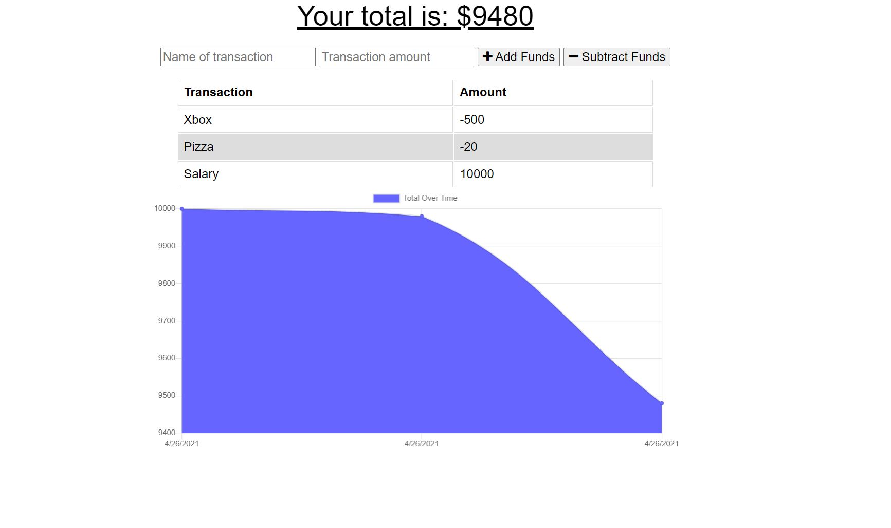

# Online-Offline-Budget-Trackers

## Description
    
I created offline functionality for the already existing online budget tracker. I used IndexedDB to create a place to store user input data offline, and then when the user is back online, the IndexedDB data is added. 
    
## Table of Contents
1. [Installation](#installation)
2. [Usage](#usage)
3. [License](#license)
4. [Questions](#questions)
5. [Credits](#credits)
    
## Installation
    
[Deployed Application](https://thawing-mesa-54023.herokuapp.com/)
    
## Usage

## License
    
MIT License
    
Copyright (c) 2021 Mike Coletta
          
## Questions?
    
[Github](https://github.com/MikeColetta)
    
For any questions, please send me an [email](mailto:coletta.mike@gmail.com).